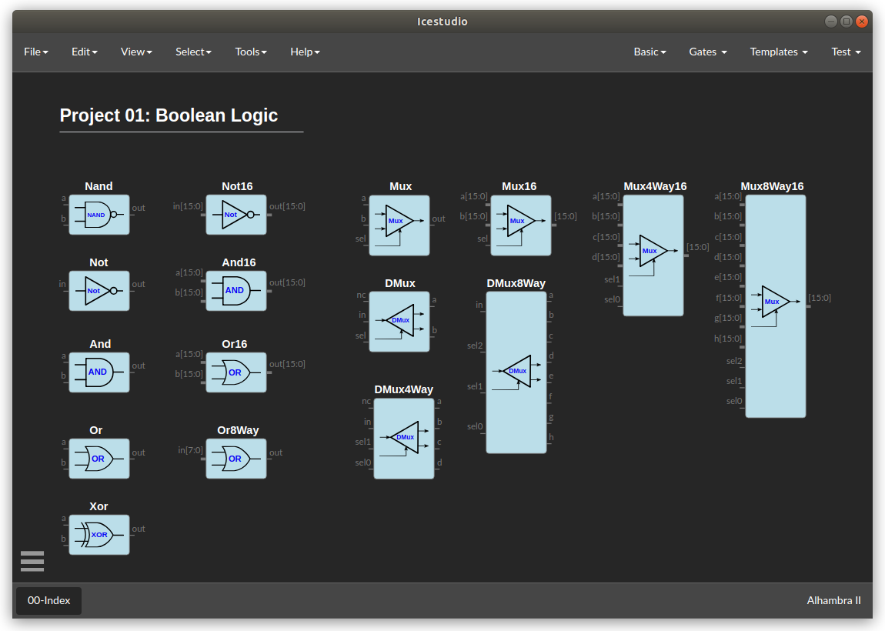
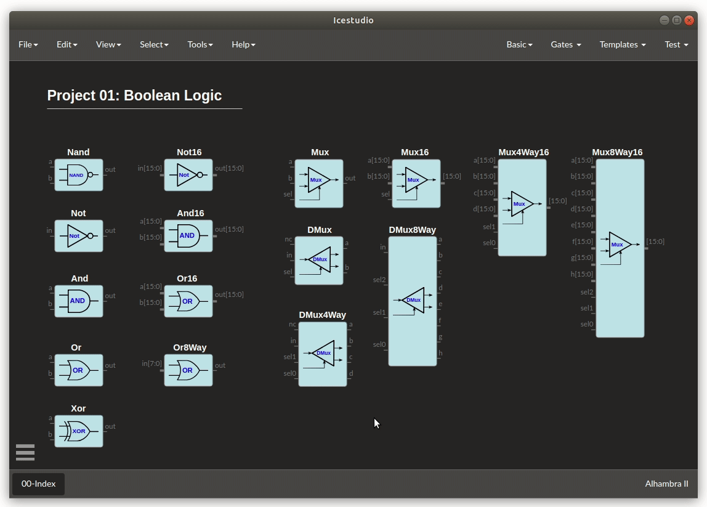
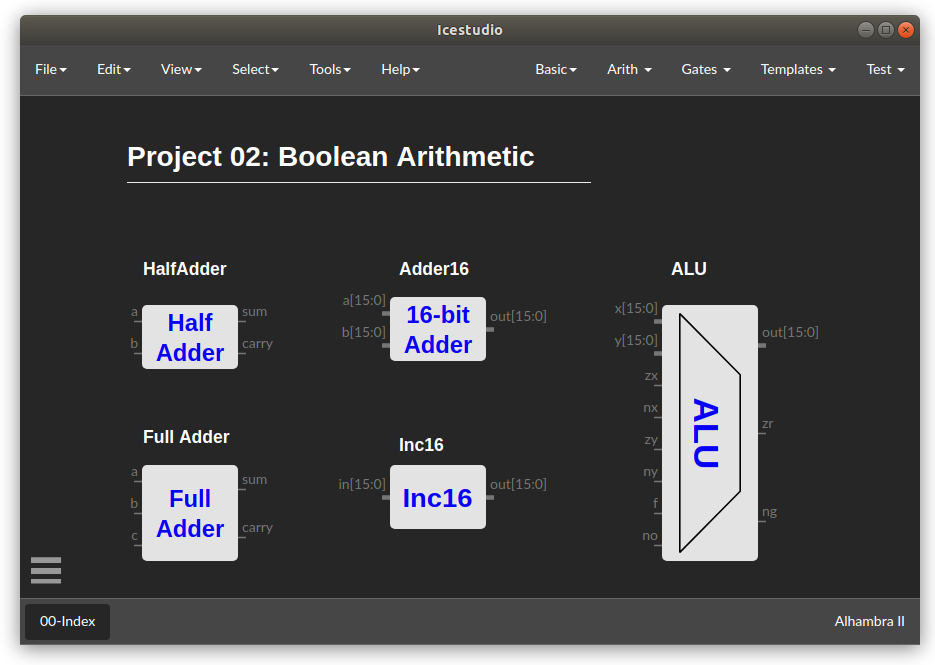
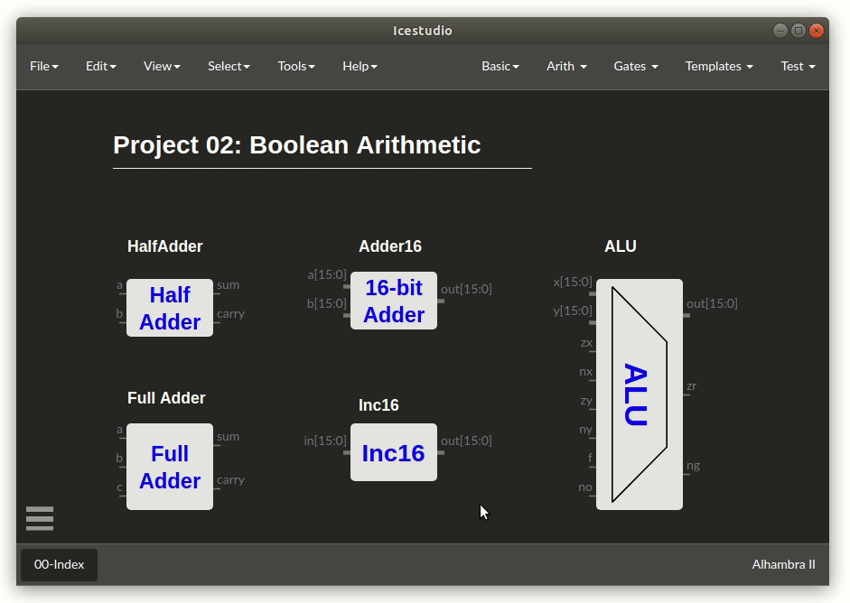
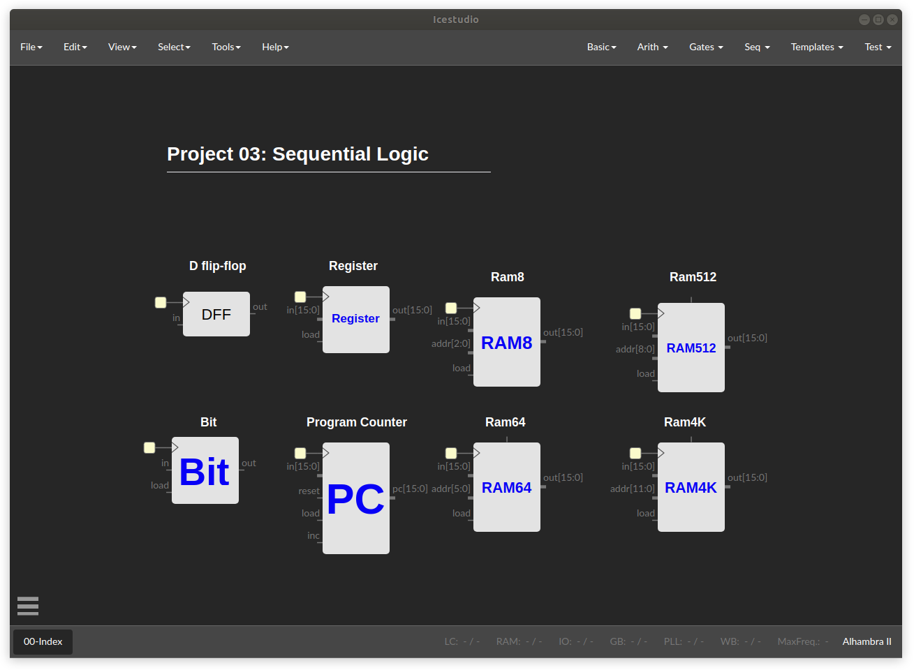
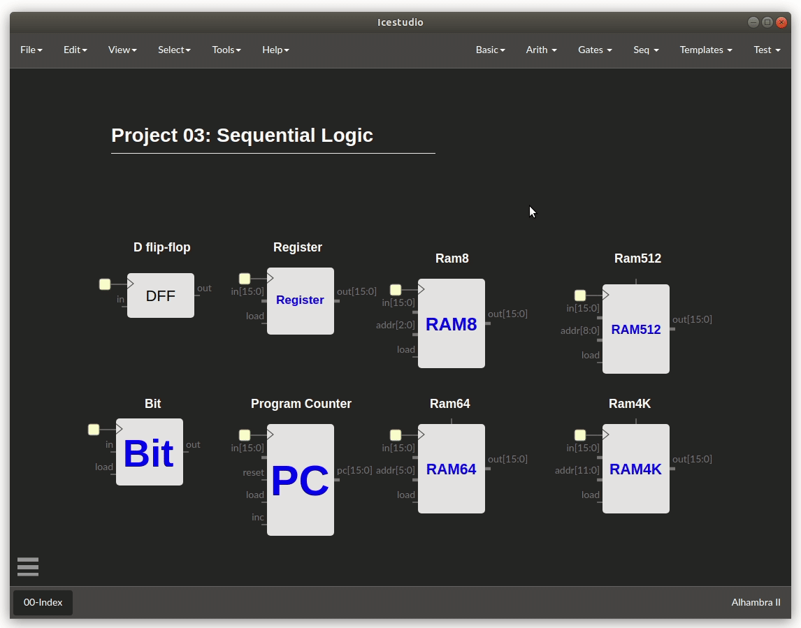
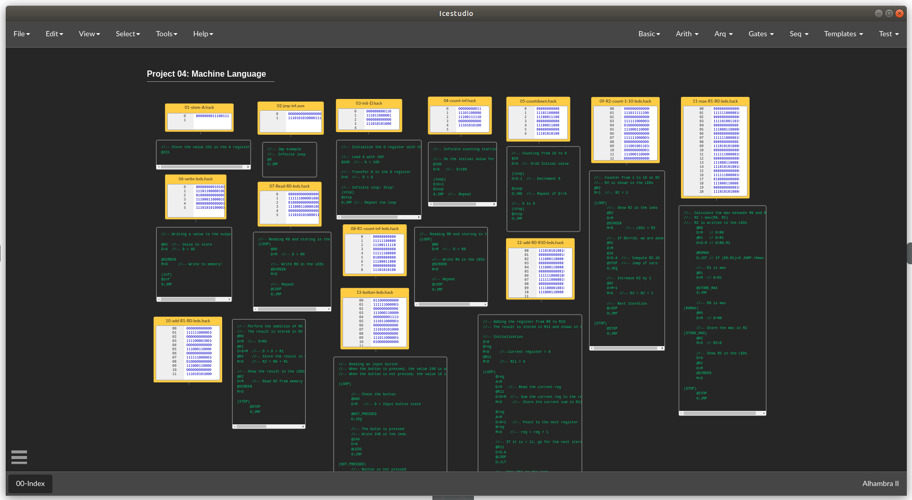
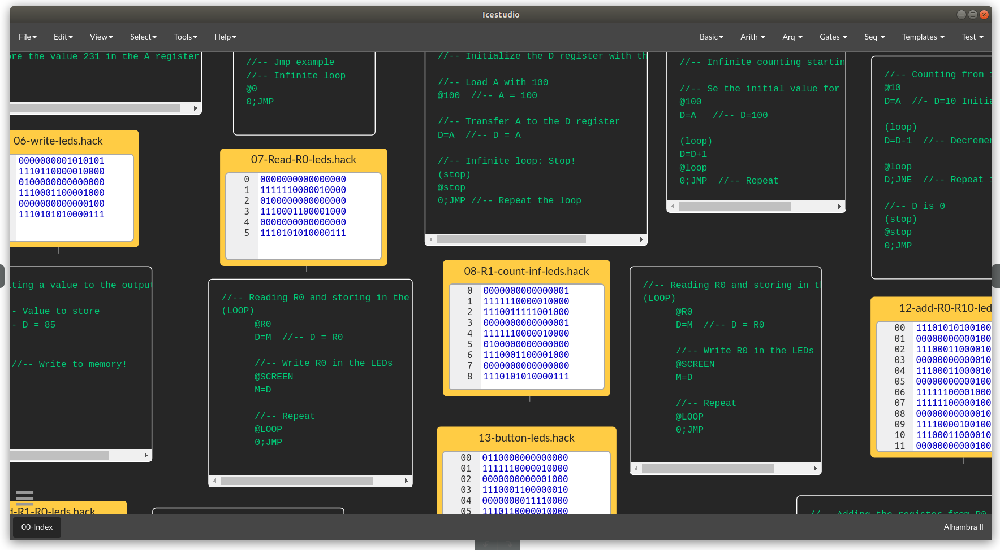

# nand2tetris-icestudio
The Nand2tetris course, using icestudio for building hardware on Opensource FPGAs from the begining

## Project 01: Boolean Logic

## Project 02: Boolean Arithmetics

## Project 03: Sequential Logic

## Project 04: Machine Language

## Project 05: Computer Architecture
